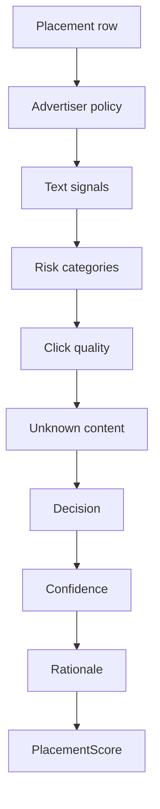

# Rules-Based Scoring

The `lunio.models.rules_based` package provides the deterministic, non-LLM
placement safety scorer. It scores placements against advertiser-specific
policies by extracting text signals, mapping them to risk categories, applying
the advertiser policy, then returning a decision, confidence, and rationale.

## Main Modules

- `classifier.py`: rule-based scoring logic and dataframe scoring helper.
- `policies.py`: universal and advertiser-specific risk category policies.
- `run_scoring.py`: script entry point for generating scored report outputs.

## Scoring Flow

`score_dataframe` is the batch entry point. It iterates over each placement row,
calls `score_placement`, and appends the resulting safety decision, confidence,
risk categories, matched signals, and rationale back onto a copy of the input
dataframe.

`score_placement` handles one placement at a time:

1. It reads `company_name` and loads the advertiser's policy from `policies.py`.
2. It calls `_build_text_signals` to collect the text that can be inspected.
3. It calls `_detect_risk_categories` to map keyword matches onto configured
   risk categories.
4. It calls `_click_quality_risk` to add `click_quality` when invalid-click rate
   is high.
5. It adds `unknown_content` when there is no usable topic/title evidence and no
   other risk was detected.
6. It calls `_decision_for_categories`, `_confidence_for_decision`, and
   `_build_rationale` to produce the final `PlacementScore`.

## Signal Extraction

`_build_text_signals` always adds URL-derived text. It parses the URL and uses
the host, path, and query string as cheap decision-time evidence. When
`use_enriched_fields=True`, it also adds non-empty `topic` and `title` values.
Those enriched fields are treated as higher-confidence evidence because they are
closer to the page's actual content than the URL alone.

`_detect_risk_categories` compares each signal with the keyword lists in
`CATEGORY_KEYWORDS`. A matched keyword adds its category to the placement's risk
set and records a matched signal such as `topic:weapon->weapons`.

## Decision Logic

`_decision_for_categories` applies the strongest matching policy outcome:

- `unsafe` if detected categories overlap with universal or advertiser-specific
  unsafe categories.
- `review` if no unsafe category matched, but detected categories overlap with
  universal or advertiser-specific review categories.
- `safe` when no configured unsafe or review category matched.

Click quality is treated as a review risk when the invalid-click rate is at or
above `INVALID_CLICK_RATE_THRESHOLD`.

## Confidence and Rationale

`_confidence_for_decision` is deliberately coarse. Enriched topic/title matches
usually produce high confidence, URL-only matches produce medium confidence, and
safe decisions from raw URL mode stay low confidence because the classifier has
less evidence. `unknown_content` also forces low confidence.

`_build_rationale` turns the machine-readable result into a short explanation
for review and reporting. It includes the advertiser, final decision, detected
risk categories, evidence mode, and matched signals.
